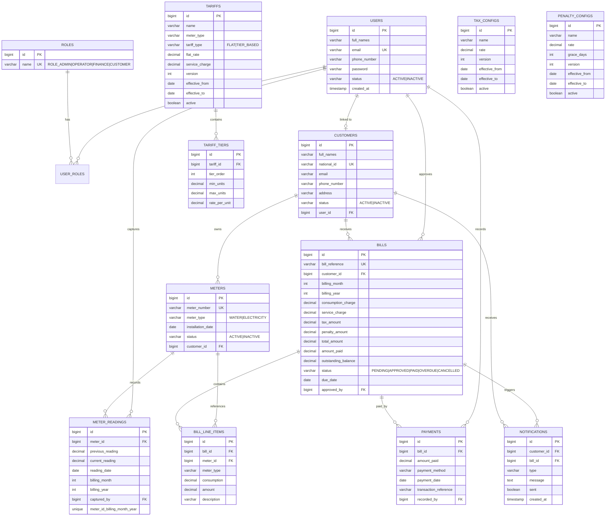

# Entity Relationship Diagram (ERD)

## WASAC/REG Utility Billing System

Database: PostgreSQL

## Key Relationships

| Relationship | Cardinality | Description |
|---|---|---|
| User ↔ Role | M:N | Users can have multiple roles via `user_roles` |
| User ↔ Customer | 1:1 | Optional link for customer portal access |
| Customer → Meter | 1:N | Each customer may have multiple meters |
| Meter → Reading | 1:N | One reading per meter per month/year |
| Tariff → Tier | 1:N | Tier-based tariffs have multiple bands |
| Customer → Bill | 1:N | Monthly bills per customer |
| Bill → Payment | 1:N | Supports partial payments |
| Bill/Customer → Notification | 1:N | Auto-generated via triggers |

## Business Rule Constraints

- `customers.national_id` — UNIQUE (no duplicate registration)
- `meters.meter_number` — UNIQUE
- `meter_readings(meter_id, billing_month, billing_year)` — UNIQUE
- `bills(customer_id, billing_month, billing_year)` — UNIQUE
- Inactive customers/meters excluded from billing
- Tariff/tax/penalty configs are versioned with `effective_from` / `effective_to`
