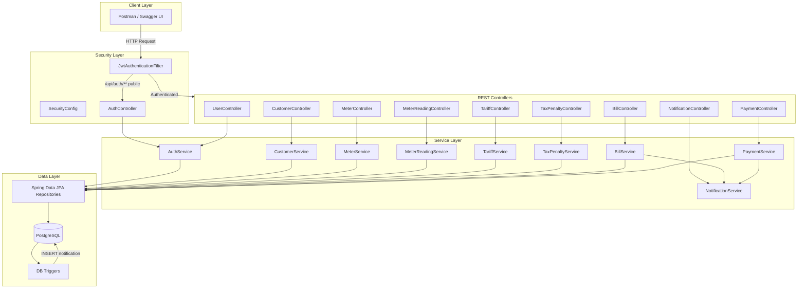

# Spring Boot Flow Diagram

## WASAC/REG Utility Billing System Architecture



## Request Flow by Task

### Task 1 — Authentication
```
POST /api/auth/register → AuthService → ROLE_CUSTOMER (public) or staff roles (admin)
POST /api/auth/login  → AuthenticationManager → JwtTokenProvider → JWT token
All other endpoints   → JwtAuthenticationFilter validates Bearer token
```

### Task 2 — Customer & Meter
```
POST /api/customers → validate unique nationalId → save
POST /api/meters    → validate unique meterNumber → link to customer
```

### Task 3 — Meter Reading
```
POST /api/meter-readings → validate:
  ✓ meter is ACTIVE
  ✓ current > previous
  ✓ one reading per meter/month/year
```

### Task 4 — Tariff Configuration
```
POST /api/tariffs → version++ → close previous tariff → save new version
POST /api/config/tax|penalty → versioned config
```

### Task 5 — Billing & Payment
```
POST /api/bills/generate → readings + tariffs + tax → create bill → notification
PATCH /api/bills/{id}/approve → status APPROVED
POST /api/payments → partial/full → update balance → PAID if zero → notification
```

### Task 6 — Database Triggers (PostgreSQL)
```
AFTER INSERT ON bills     → INSERT notification (BILL_GENERATED)
AFTER INSERT ON payments  → IF fully paid → UPDATE status PAID + notification
```

## Role-Based Access

| Endpoint | ADMIN | OPERATOR | FINANCE | CUSTOMER |
|---|:---:|:---:|:---:|:---:|
| /api/auth/** | ✓ | ✓ | ✓ | ✓ |
| /api/users/** | ✓ | | | |
| /api/customers | ✓ | ✓ | ✓ | |
| /api/meters | ✓ | ✓ | | |
| /api/meter-readings | | ✓ | | |
| /api/tariffs, /api/config | ✓ | | ✓ | |
| /api/bills | ✓ | | ✓ | view own |
| /api/payments | ✓ | | ✓ | view own |
| /api/notifications | ✓ | | ✓ | view own |
